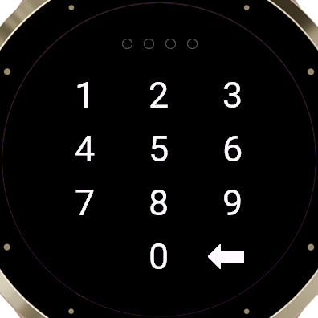

# OTP Manager for Garmin

A Connect IQ watch app that reads your
[Nextcloud OTP Manager](https://github.com/matteo-convertino/otpmanager-nextcloud)
vault and generates TOTP codes on the watch. Open it, pick an account, read the
code off your wrist.

| Accounts | Code | Locked |
|---|---|---|
|  |  |  |

Supported on **44 watches** across the Venu, vívoactive, Forerunner, fenix and
epix families.

> **A touch screen is required.** The PIN keypad is tap-only, so button-only
> watches — the Instinct family, and the Forerunner 255 — are not supported. On
> one of those you could sign in and read codes but never set a PIN, which is
> not a version of this app worth shipping.

<details>
<summary>The full list</summary>

| Family | Watches |
|---|---|
| epix | epix™ (Gen 2) / quatix® 7 Sapphire, epix™ Pro (Gen 2) 42mm, epix™ Pro (Gen 2) 47mm / quatix® 7 Pro, epix™ Pro (Gen 2) 51mm / D2™ Mach 1 Pro / tactix® 7 – AMOLED Edition |
| fenix | fēnix® 7 / quatix® 7, fēnix® 7 Pro, fēnix® 7 Pro - Solar Edition (no Wi-Fi), fēnix® 7S, fēnix® 7S Pro, fēnix® 7X / tactix® 7 / quatix® 7X Solar / Enduro™ 2, fēnix® 7X Pro, fēnix® 7X Pro - Solar Edition (no Wi-Fi), fēnix® 8 43mm, fēnix® 8 47mm / 51mm / tactix® 8 47mm / 51mm / quatix® 8 47mm / 51mm, fēnix® 8 Pro 47mm / 51mm / MicroLED / quatix® 8 Pro 47mm / 51mm, fēnix® 8 Solar 47mm, fēnix® 8 Solar 51mm / tactix® 8 Solar 51mm, fēnix® 9 43mm, fēnix® 9 47mm / 51mm, fēnix® 9 Pro 43mm, fēnix® 9 Pro 47mm, fēnix® 9 Pro 51mm, fēnix® 9 Pro Solar 47mm, fēnix® 9 Pro Solar 51mm, fēnix® E |
| Forerunner | Forerunner® 165, Forerunner® 165 Music, Forerunner® 170, Forerunner® 170 Music, Forerunner® 265, Forerunner® 265s, Forerunner® 570 42mm, Forerunner® 570 47mm, Forerunner® 70, Forerunner® 955 / Solar, Forerunner® 965, Forerunner® 970 |
| Venu | Venu® 3, Venu® 3S, Venu® 4 41mm, Venu® 4 45mm / D2™ Air X15, Venu® X1 |
| vívoactive | vívoactive® 5, vívoactive® 6 |

</details>

Codes are computed on the watch itself. The account list is cached, so the app
opens instantly and keeps working with your phone out of range — only the
**Refresh** row at the bottom of the list goes back to the server.

## What you need

- A Nextcloud server running the OTP Manager app, reachable over **HTTPS**.
- One of the watches listed above.
- The Connect IQ SDK. There is no public store listing, so you build the app
  and install it on your own watch. That is a twenty-minute job, once.

## Installing

Two routes, and the first is the better one for normal use:

|  | Settings | Install |
|---|---|---|
| **Beta app** | a real settings screen on your phone | through the store, to your own Garmin account |
| **Sideload** | none — compiled into the build | over USB |

A sideloaded app gets no settings UI from Garmin at all: it does not appear in
the Connect IQ mobile app, and Garmin Express will not show its settings either.
So everything has to be baked into the binary and changing one value means
rebuilding. Uploading it as a beta app avoids all of that, and needs no review.

Both routes need the SDK and a signing key first.

### 1. SDK and signing key

Get the SDK through Garmin's [SDK Manager](https://developer.garmin.com/connect-iq/sdk/),
which needs a free Garmin account, and install the device profile for your watch.
You only need the one you own — `./build.sh local` takes a device argument, and
the default is `venu3s`.

Every build is signed, even for sideloading. Any RSA key will do, as long as it
stays the same across rebuilds:

```bash
mkdir -p ~/.Garmin/keys && cd ~/.Garmin/keys
openssl genrsa -out developer_key.pem 4096
openssl pkcs8 -topk8 -inform PEM -outform DER -nocrypt \
    -in developer_key.pem -out developer_key.der
chmod 600 developer_key.*
```

Keep it. If you ever upload to the store, that key becomes the permanent
identity of the listing and no future update can be signed without it.

### 2a. Upload it as a beta app

Accept the developer agreement once at [apps.garmin.com/dsa](https://apps.garmin.com/dsa),
then:

```bash
./build.sh beta
```

Upload `build/otpmanager-beta.iq` at
[apps.garmin.com/en-US/developer/upload](https://apps.garmin.com/en-US/developer/upload)
with the **Beta App** box ticked. It goes live immediately, and only your own
Garmin account can see it.

> **A beta app never appears in store search.** It is link-only, and the link
> has to come from the older dashboard at `apps.garmin.com/developer/dashboard`
> — links from the newer `apps-developer.garmin.com` will not open the Connect
> IQ phone app. Copy the address, open it on your phone, install from there.

### 2b. Or sideload it

```bash
cp local.properties.example local.properties
$EDITOR local.properties          # gitignored; never commit it
./build.sh local fenix7s          # your device; defaults to venu3s
```

`local.properties` holds the server URL, your Nextcloud user ID and app
password, your vault password, and optionally a PIN. They are compiled in as
defaults and the file is the only place they live; `build.sh` restores
`resources/properties.xml` afterwards, including if the build fails.

Then copy the `.prg` across. The watch enumerates as **MTP**, not mass storage,
so `cp` fails with `Operation not supported` — use `gio`:

```bash
gio mount -l | grep mtp://          # find the device address
gio copy build/otpmanager-fenix7s.prg \
    "mtp://<device>/Internal Storage/GARMIN/Apps/otpmanager-fenix7s.prg"
```

The directory is `GARMIN/Apps` — check the capitalisation on the device rather
than trusting the Connect IQ documentation, which says `APPS`, and note that it
is not created for you if you get it wrong. On macOS use
[Android File Transfer](https://www.android.com/filetransfer/); on Windows drag
the file into the same folder in Explorer.

> **The `.prg` disappears from `GARMIN/Apps` once installed, and that is the
> success signal** — the watch ingests it on eject. An empty folder next time
> you plug in means it worked.

To change anything later, edit `local.properties`, rebuild, copy across again,
and **delete the matching `.SET` file from `GARMIN/Apps/SETTINGS`**. It holds
the previous install's values and overrides your new defaults, which looks
exactly like the app ignoring its configuration.

## Setting it up

A beta or store install is configured in two places, and only one of them is a
keyboard.

In Garmin Connect, under the app's settings:

| Setting | What it is |
|---|---|
| Nextcloud URL | e.g. `https://cloud.example.com` — must be `https://` |
| OTP Manager password | your vault password |

The vault password has to be typed because nothing can tell the watch what it
is: your server keeps only a hash of it. If your vault has no password, put any
non-empty value here.

> It is not a secret the watch keeps entirely to itself. Each refresh posts it
> to OTP Manager's `/password/check` over HTTPS, which verifies it against that
> hash and returns the IV your secrets are encrypted with. The server receives
> the password to check it, and does not store the plaintext. What stays on the
> watch is the decryption: your secrets are never decrypted server-side.

Then, on the watch:

1. **Sign in.** A notification appears on your phone; tap it, sign in to
   Nextcloud in the web view that opens — SSO and two-factor included — and
   grant access. The watch is waiting while you do and moves on by itself.
2. **Set a PIN**, or **Not now**. Offered once here, and available afterwards
   under **Options**.

Nothing else is typed. Your login name and a fresh Nextcloud app password come
back from the server and stay on the watch.

**Options**, at the bottom of the account list, also has **Sign out** — which
forgets the credentials and the cached accounts and returns you to the sign-in
screen. To change your vault password later, type the new one into the settings
screen; the next unlock picks it up.

## Locking it with a PIN

Optional, 4 to 8 digits, and set on the watch itself. You type it twice, on the
same keypad that asks for it afterwards.

Once it is set:

- The app asks for it when you open it, and then not again for **24 hours** —
  as long as the watch stays on your wrist. Take the watch off for ten minutes,
  or restart it, and the next launch asks again.
- **Both passwords are encrypted under it.** Neither is left anywhere on the
  watch in the clear, and the vault password is cleared from the settings screen
  once the PIN has replaced it.
- Unlocking takes two or three seconds. That is the PIN being turned into a
  key, and it is deliberate.

**Change PIN** and **Sign out** are both under Options, and forgetting it is not
a disaster: sign out, sign in again, choose a new one.

Be clear about what it buys. Against someone who picks your watch up it is the
real thing — they get a keypad and nothing else. Against someone who copies the
watch's storage and attacks it offline it buys time and no more, because a watch
cannot afford the kind of key derivation that would make a short numeric PIN
expensive to guess.

> **While an unlock is live, offline PIN protection is suspended.** The key your
> PIN derives is written to watch storage so the next launch can skip the
> keypad — that is the only way Connect IQ allows a grace period to survive an
> app exit, as it offers no protected storage to put a secret in. Anyone who
> copies storage during those 24 hours can open your credentials without the
> PIN and without attacking it. The key is erased when the unlock ends, but
> only when the app next runs and notices, so it can outlive the window on a
> watch that is not opened again.

## Limitations

- **TOTP only.** HOTP accounts appear in the list but say so when opened —
  generating one has to advance a server-side counter, which is not implemented.
- **No SHA-512.** Connect IQ offers SHA-1 and SHA-256 only. SHA-512 accounts
  appear in the list and say so when opened. SHA-1, the default, is fine.
- **Shared accounts are not shown**, only your own — a locked share is encrypted
  with the sharing password rather than your vault key.
- Accounts are listed **grouped by issuer**, then by name. There is no way to
  re-sort from the watch, and no search.
- Labels too long for the screen **scroll** rather than being cut off. Garmin's
  touch devices never mark a row as focused, so every over-long label scrolls
  rather than just a selected one.
- The watch clock drives the codes. Garmin keeps it synced; a watch that has
  been off-grid for a long time may drift far enough to matter.

## Security

The watch computes your codes, so it necessarily holds what is needed to compute
them. What differs is whether it holds it in the clear.

**With a PIN**, both passwords are encrypted under it, and a watch that has been
off your wrist shows a keypad rather than your codes.

**Without one**, the app password sits in the watch's own storage and the vault
password in the app's settings, both in the clear — Connect IQ has no encrypted
storage to put them in, so every app that needs a credential is in the same
position. A sideload with no PIN also carries both inside the `.prg`, so treat
that file the way you would treat the passwords themselves.

**The cached account list** holds secrets as the server sent them. For a vault
with a password that is ciphertext, and the password that opens it is inside the
seal. For a vault *without* one the server sends TOTP seeds in the clear, so
with a PIN set they are encrypted under it before being cached — which protects
them once an unlock has ended, though not while one is live, for the reason in
[Locking it with a PIN](#locking-it-with-a-pin) above.

Either way, what the watch holds is a Nextcloud **app password**, not your login
password. If you lose the watch, revoke it under **Settings → Security → Devices
& sessions**. That stops refreshes, though a cached list will keep generating
codes until the app is deleted, and signing out on the watch clears its copy but
revokes nothing.

The app talks only to the server you configure, over HTTPS — Connect IQ refuses
plain HTTP outright — and sends nothing anywhere else. Secrets are decrypted on
the watch exactly as the web client does it, and the account cache holds them
still encrypted, as the server sent them.

## Development

```bash
./build.sh              # a signed .prg for a representative device per icon size
./build.sh local [dev]  # one .prg with local.properties compiled in
./build.sh test         # unit tests, in the simulator
./build.sh export       # a .iq for the store
./build.sh beta         # a .iq for the store's Beta App slot
```

The tests run on the device VM rather than a host reimplementation, and cover
base32 decoding, the RFC 6238 vectors for SHA-1 and SHA-256, AES decryption
against a ciphertext produced the way the server produces one, the sealed
credential format, what a sign-in response has to contain, and the rule that
decides whether the watch has stayed on your wrist.

Two are worth knowing about. One opens a sealed blob produced by
`tools/seal.py`, so the watch and the build-time sealer are checked against each
other rather than each against itself — the two key derivations have to agree
byte for byte or it fails. The other feeds the wear rule fabricated heart rate
samples, which is the only way to take a watch off a wrist from a test suite.

On a current Linux distro neither the SDK Manager nor the simulator will start:
both want `webkit2gtk-4.0` and `libsoup2.4`, which have aged out of every
shipping release. An Ubuntu 22.04 container runs them. `monkeydo` is Java and
reaches the simulator on `localhost:1234`, so run the container with host
networking and drive it from outside.

## Licence

MIT — see [LICENSE](LICENSE). Not affiliated with the upstream OTP Manager
project or with Garmin.
