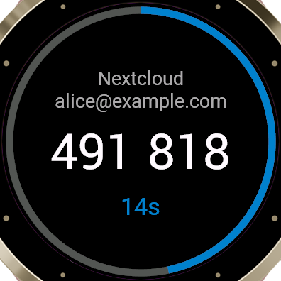

# OTP Manager for Garmin

A Connect IQ watch app that reads your
[Nextcloud OTP Manager](https://github.com/matteo-convertino/otpmanager-nextcloud)
vault and generates TOTP codes on the watch. Open it, pick an account, read the
code off your wrist.

| Accounts | Code |
|---|---|
|  |  |

Supported devices: **Venu 3S**, **Venu 3**, **vívoactive 5**.

## How it works

The app talks to the OTP Manager OCS API over HTTPS, authenticating as you with
a Nextcloud app password:

1. `GET /password/status` — does the vault use an encryption password?
2. `POST /password/check` — if it does, this returns your per-user IV.
3. `GET /accounts` — the account list, secrets still encrypted.

Secrets are decrypted on the watch, exactly as the web client does it:
AES-256-CBC, keyed on `SHA-256(your OTP Manager password)`, with the IV from
step 2. Codes are then generated per RFC 6238.

The account list is cached on the watch, so the app opens instantly and keeps
working with no phone nearby. Only the **Refresh** entry at the bottom of the
list goes back to the server — launching the app does not.

## Installing

There is no Connect IQ store build, so the app is sideloaded: you build it and
copy it to the watch.

Configuration is part of the build rather than a later step, because **Garmin
supports no settings UI for sideloaded apps** — a sideloaded app does not appear
in the Connect IQ mobile app at all, and Garmin Express does not offer its
settings either. There is nowhere to type the server details afterwards, so they
go in beforehand.

### 1. Install the Connect IQ SDK

Get it through Garmin's [SDK Manager](https://developer.garmin.com/connect-iq/sdk/),
which needs a free Garmin account. Install the SDK and the device profile for
your watch (`venu3s`, `venu3` or `vivoactive5`).

> On a current Linux distro the SDK Manager will not start: it needs
> `webkit2gtk-4.0` and `libsoup2.4`, which have aged out of every shipping
> release. Running it in an Ubuntu 22.04 container works.

### 2. Generate a developer key

Every `.prg` has to be signed, even for sideloading. Any RSA key will do — it
just has to stay the same across rebuilds:

```bash
mkdir -p ~/.Garmin/keys && cd ~/.Garmin/keys
openssl genrsa -out developer_key.pem 4096
openssl pkcs8 -topk8 -inform PEM -outform DER -nocrypt \
    -in developer_key.pem -out developer_key.der
chmod 600 developer_key.*
```

### 3. Enter your server details

```bash
cp local.properties.example local.properties
$EDITOR local.properties          # gitignored; never commit it
```

| Setting | What it is |
|---|---|
| `serverUrl` | e.g. `https://cloud.example.com` — must be `https://` |
| `username` | your Nextcloud **user ID** (see below) |
| `appPassword` | Nextcloud → **Settings → Security → Devices & sessions** |
| `otpPassword` | your OTP Manager vault password |

Use a Nextcloud **app password**, not your login password — it can be revoked on
its own and it sidesteps two-factor prompts.

`username` is the Nextcloud user ID, which is not always the short name you type
at a login form. Servers that provision users through OIDC or SSO commonly set
it to the email address instead. The app-password screen shows the login name to
use, and `GET /ocs/v2.php/cloud/user` returns it as `id` if you want to be sure.

Leave `otpPassword` as any non-empty value if your vault has no encryption
password; it is ignored then.

### 4. Build

```bash
./build.sh local
```

`build.sh` reads the active SDK from `~/.Garmin/ConnectIQ/current-sdk.cfg` and
the key from `~/.Garmin/keys/developer_key.der` (override with `DEVELOPER_KEY`).
It writes `build/otpmanager-venu3s.prg` with your values compiled in as the
property defaults, then restores `resources/properties.xml` — including if the
build fails — so credentials are never left in the working tree.

> The resulting `.prg` contains both passwords in the clear. Treat that file the
> way you would treat the credentials themselves.

Plain `./build.sh` builds every supported device with empty defaults. That is
the right thing for a store submission and useless on a sideloaded watch.

### 5. Copy it to the watch

Plug the watch in over USB. It enumerates as **MTP**, not as a USB mass storage
device, so there is no block device to mount — the file goes through the
desktop's MTP mount instead. On Linux that needs `gvfs-backends` and `libmtp`.

`cp` does not work here: writing into a gvfs MTP mount through ordinary POSIX
calls fails with `Operation not supported`. Use `gio`, which goes through the
GVfs API:

```bash
gio mount -l | grep mtp://          # find the device address
gio copy build/otpmanager-venu3s.prg \
    "mtp://<device>/Internal Storage/GARMIN/Apps/otpmanager-venu3s.prg"
```

The destination is `GARMIN/Apps/` on the watch's internal storage. Check the
capitalisation against the device rather than assuming — it is `Apps` on a
Venu 3S, though `APPS` is what most Connect IQ documentation says, and the
directory is not created for you if you get it wrong.

On macOS use [Android File Transfer](https://www.android.com/filetransfer/), and
on Windows the watch appears in Explorer; drag the `.prg` into the same folder.

Unplug the watch. The app appears in the **watch's** activity/app list as
**OTP Manager** — not in the Connect IQ mobile app, which only ever lists
store-installed apps.

> **The `.prg` disappears from `GARMIN/Apps` once installed, and that is the
> success signal.** The watch ingests it into internal storage on eject and
> deletes the file. What it leaves behind is a `.SET` of the same name in
> `GARMIN/Apps/SETTINGS`, holding the app's settings. An empty `GARMIN/Apps`
> next time you plug in means the install worked, not that it vanished.

### Changing the configuration later

Edit `local.properties`, run `./build.sh local` again, and copy the new `.prg`
across as in step 5 — there is no old one to overwrite, since the watch consumed
it at install time.

Also delete the matching `.SET` file from `GARMIN/Apps/SETTINGS`. It holds the
values captured at the previous install and overrides the new compiled-in
defaults, so without this the app appears to ignore its new configuration. The
watch recreates it on the next eject. This is only needed when the values
change; reinstalling the same configuration can leave it alone.

> Sideloading involves no Garmin account — that is only needed to download the
> SDK in the first place.

> If the app is ever published to the Connect IQ Store, none of this applies:
> store-installed apps get the normal settings screen in Garmin Connect, which is
> why the committed `properties.xml` ships with empty defaults.

## Limitations

- **TOTP only.** HOTP accounts appear in the list but say so when opened —
  generating one has to advance a server-side counter, which is not implemented.
- **No SHA-512.** Connect IQ offers SHA-1 and SHA-256 only. SHA-512 accounts
  appear in the list and say so when opened. SHA-1, the default, is fine.
- Accounts are listed **grouped by issuer**, then by name, case-insensitively.
  One with no issuer sorts under its own name. The server's own order is not
  useful on a watch, and there is no way to re-sort from the device.
- A provider or account name too long for the screen **scrolls** rather than
  being cut off. Garmin's touch devices never mark a list row as focused, so
  there is no "selected" row to scroll on demand — every over-long label
  scrolls, and the animation stops entirely when nothing on screen needs it.
- **Shared accounts are not shown**, only your own. `GET /accounts` returns
  both; entries flagged `isShared` are skipped, because a locked share is
  encrypted with the sharing password rather than your vault key.
- The watch clock drives the codes. Garmin keeps it synced; a watch that has
  been off-grid for a long time may drift far enough to matter.

## Security

Getting a code onto your wrist means the watch can compute it, so the watch
holds everything needed to do that:

- The Nextcloud app password and the vault password are stored in Connect IQ
  application properties, in the clear. The settings fields are masked when you
  type them, but Connect IQ has no encrypted storage to put them in.
- The cached account list holds secrets exactly as the server sent them, still
  encrypted — but the key is derived from a password sitting next to it.

Treat the watch as you would an unlocked authenticator app. If you lose it,
revoke the Nextcloud app password; that cuts off refreshes, though a cached
list will still generate codes until the app is deleted.

The upstream scheme itself is worth knowing about: the IV is per user rather
than per secret, and there is no authentication tag, so a wrong password is
detected only by an implausible PKCS#7 padding. That is upstream's design, not
this app's, and this app is deliberately bug-compatible with it.

## Development

```bash
./build.sh              # one signed .prg per device, into build/
./build.sh test         # unit tests, in the simulator
```

The tests cover base32 decoding, the RFC 6238 vectors for SHA-1 and SHA-256,
and AES decryption against a ciphertext produced the way the server produces
one. They run on the device VM, not on a host reimplementation.

The simulator has the same `webkit2gtk-4.0` problem as the SDK Manager, and in
a container it also needs `libusb-1.0-0`. Run it with host networking:
`monkeydo` is Java, has no counterpart inside the image, and reaches the
simulator on `localhost:1234`.

## Licence

MIT — see [LICENSE](LICENSE). Not affiliated with the upstream OTP Manager
project or with Garmin.
